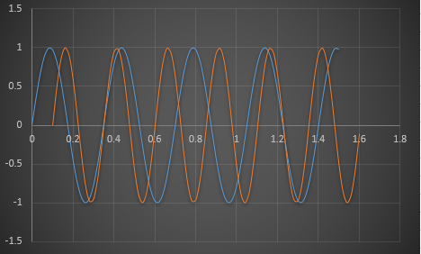
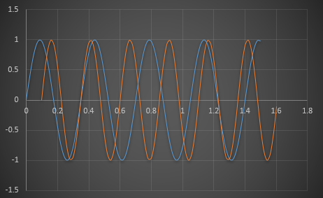

## Ranjit Roshan
I am a undergrad student who found his flow in drone design and development. Feel free to check my projects and works.

## Project Index 
-> **Python API to automate belt drive design**  
-> **Data logging API for Drone test rig**

Python API to automate belt drive design
=============================================================================

The Project involves the creation of an application to automate the design process of a flat-belt drive system. The manual design calculation is a tiresome process involving many substitutions in pre-derived formulae and in case of design failure during stress testing, the design process has to be repeated again from the beginning. This is not only a tiresome process but also an inefficient one. Thus with the advancement of faster computing and better user interfaces an application can be programmed or created to automate the above explained process. These programs can produce results with viable inputs in seconds. Design failure can be treated with absolute simplicity i.e. just by altering the input values and the rest of the process is executed once again automatically at the click of a button.

Github:  
_Python API Screen:_

_Output in PDF Format:_

Data logging API for Drone test rig
=============================================================================

In order to understand and tune the drone features like battery life, PID values, throttle curve etc there is the need for data logging. This API provides the tool to record data and is based on Pyserial and Arduino library. Hence the program is portable to any place just using some arduino pins and a USB-COM Port. The program saves the data in a time-stamped file with a meta-file which stores additional user data during the initial and final stages of recording. The data is stored in plain text documents as comma seperated files(.csv) which can used in data analysis tools like pandas and excel.

Github:  
_API Interface:_

_Data and Meta files:_

Damping characteristics visualisation using Excel 
=============================================================================

Based on the spring and damper hard point data of a vehicle te compression and rebound curves are plotted. The plot gives compression and rebound force for various velocities which are tuned by adjusting the damping coefficient for better ride characteristics

Vehicle flat ride curve for different configurations - Gross and half load
=============================================================================

The ride frequency is a fucntion of the front and rear spring attributes, sprung and unsprung mass. The curve behaves differently for different loading conditions such as Curb-weight, which is only the weight of the car without passengers and the gross weight which includes passenger and cargo. The ride frequency must be between 1~2 hz and a lower or higher value will cause rider discomfort and nausea. Hence this plot is used to analyze the oscillations.

_Curb weight plot_

_Gross Vehicle Weight Plot_

_Half Load Plot

