## Research Papers
1. _Ranjit Roshan, Noufal and Vigneshwar, **“Resilience Optimization of Octocopter Drone using two stage thrusters and thrust vector           locking”** Proceedings of IEEE GCAT 2019 Banglore,India, Oct. 18-20, 2019._
   
   **Octocopters** use fault handling programs to stabilize and land safely in case of a motor failure. This paper is about ,_how the motors      can be optimally placed and thrust vectoring can be used, to stabilize and resume normal operation in case of motor failure or            propeller breakage._ The full paper will soon be published in IEEE Xplore magazine. 

   <iframe src="https://drive.google.com/file/d/1jNvBdA2fRnG-w4m8zawcSeFp4FVdWGCp/preview" width="440" height="280"></iframe>

## Awards
1. **Student Project Grant | International Academy RWTH Aachen**

   Received project grant for development of a drone image based solar panel dust estimation system. This project was a continuation of a      previous project involving the development of deep neural network model for the same. Refer here for more info (). As a part of this        project, initially drone image data was collected at 2 solar power generation units in Tamil Nadu (Crescent Institute of Science and        Technology and at a 15 MW solar power plant in Thenkasi.

   <iframe src="https://drive.google.com/file/d/1frfdqyGKVegcxbKVoNr662YbZtls15oP/preview" width="440" height="280"></iframe>
   <iframe src="https://drive.google.com/file/d/1edMQ4fH0RSB952jtXlrJTYzpmJhN-_Sa/preview" width="440" height="280"></iframe>
   <iframe src="https://drive.google.com/file/d/1u4Th8CstG_rgNADBfpRCjAntKjXVsCtF/preview" width="440" height="280"></iframe>
   
   Further processing is to be made to make the dataset ready for re-training the machine learning model.

## Project Index 

1. **Retractable arm induced dynamically stable quadrotors** [read more](#projectm)  

2. **Drone development for a national level robotics competition** [read more](#projectg)  

3. **H-I-X Quadcopter frame design fabrication and flight** [read more](#projecte)  

4. **Python API to automate belt drive design** [read more](#projecta) 

5. **Data logging API for Drone test rig** [read more](#projectb) 

6. **Two motor test rig to understand PID Tuning** [read more](#projectf)  

7. **Micro quadcopter frame design and fabrication** [read more](#projectl)  

8. **Robotic Arm design and circuit fabrication** [read more](#projectj)  

9. **Bicopter controller circuit design** [read more](#projecth)  

10. **Quadcopter control system programming using Arduino** [read more](#projectk)  

11. **IMU Visualization using VPython** [read more](#projectn)  

Retractable arm induced dynamically stable quadrotors
=============================================================================
[Back to Project List](#projectlist) &nbsp;&nbsp; _Feb 2019_

**Overview:**  
To implement a drone with variable arm characteristics with the intention to increase the number of available controllable outputs a drones can have.  
**Drone Development:**  
As I was studying about the dynamics of drones, I understood that the yaw motion is the consequence of variation in the speed of the diagonal motors but I didn't understand what exactly induced it.  
                  _Gyroscopic approach_: My first approach was with the gyroscopic effect. Gyroscopic principles state that "when the axis of a rotating body is tilted along another perpendicular axis, then there is a resultant twist about the axis perpendicular to the plane of the other two axis". I removed the propellers and with the rotors spinning, I varied the diagonal motors and felt a twist along the yaw  axis, but the magnitute seemed too feebile to produced when hovering.  
                  _Drag approach_: Then I took a long journey across the internet and library to find a solution. I narrowed down to the effect of propeller drag and Eureka! I found it. As the propellers rotate, there is a production of workable thrust only when the thrust line crosses the drag point of a thrust-drag-rpm plot. This drag like the back-emf is present all the time and as the propeller spins, there is a production of torque about the center of rotation with respect to the center of the drone. 
                  Assume that the propeller is spinning in an arm of the drone and the propeller at this instantaneous point of time is aligned with the drone arm (paraller to it). The drag exists on both the prop sections (here we are assuming a two bladed propeller) and since one section is present at a longer distance from the center of the drone the torque is more (Torque = force x perpendicular distance). When the motor spin clockwise the drag is counter-clockwise and this causes the drone to yaw CCW (counterclockwise) when the CW motors are spun faster.

<iframe src="https://drive.google.com/file/d/1dEdEg9m9lDrS9L9X1MfINeurol68L-_d/preview" width="440" height="280"></iframe>

Drone development for a national level robotics competition
=============================================================================
[Back to Project List](#projectlist) &nbsp;&nbsp; _June 2019_

**Overview:** 
The challenge was to design a frame based on given constraints such as max gross weight of 2 kg and max possible dimensions as 75x75x75 cm.
**Drone Development:** 
- We planned to design the frame using aluminium with some weight reduction plans.
- Every component of the drone was modelled, assembled and the flight was animated in blender to get a visualization of our end goal.
- We created a retractable landing gear system completely by ourselves from scratch and wrote a ground station program to control the retracting action from it.
- We chose NRF for communication between the base station and the drone, but due to high signal interference (SNR) we had to switch to static legs to reduce uncertainity.
- The APM 2.8 provided the primary flight control system, while we coded an auxillary control system for retractable landing gears and battery monitoring. 

<iframe src="https://drive.google.com/file/d/19g-Re-91fd9U9xsiCjbfMogw3VF6hVkX/preview" width="440" height="280"></iframe>
<iframe src="https://drive.google.com/file/d/1ijBxgE2g2eeYl49UX6tmJkN4vhrk08eI/preview" width="340" height="180"></iframe>
<iframe src="https://drive.google.com/file/d/1_sE8QI4CoPbFCLRbtQGFpamv8rDjET-l/preview" width="440" height="280"></iframe>
<iframe src="https://drive.google.com/file/d/13qw0g4WzbTRAgL1LZvhbk4GM85R-7lYN/preview" width="440" height="280"></iframe>
<iframe src="https://drive.google.com/file/d/1WmLQ0-KMnjIk4gx-XqOTp5qRfpA_5LjI/preview" width="440" height="280"></iframe>
<iframe src="https://drive.google.com/file/d/11THzFgK_0sxOxADpVy2Rr1F-UhByDoRU/preview" width="440" height="280"></iframe>

H-I-X Quadcopter frame design fabrication and flight
=============================================================================
[Back to Project List](#projectlist) &nbsp;&nbsp; _Dec 2017_

**Overview:** 
The common basic geometries of quadcopter frames are H, I and X type each with its own advantage during flight. This project is to design a frame by combining all the geometries.  
**Features:** 
- The outer arms are angled with respect to the pitch and roll axis, while a beam like structure holds them together.
- The aluminum frame is welded together with the legs at a angle to the yaw axis.
- This is a research experiment to understand the moment of inertia and how trade-off's are made to attain stable flight and structural integrity.
- The outer cover is 3D printed using ABS plastic.
- APM 2.8 is used to control the drone.

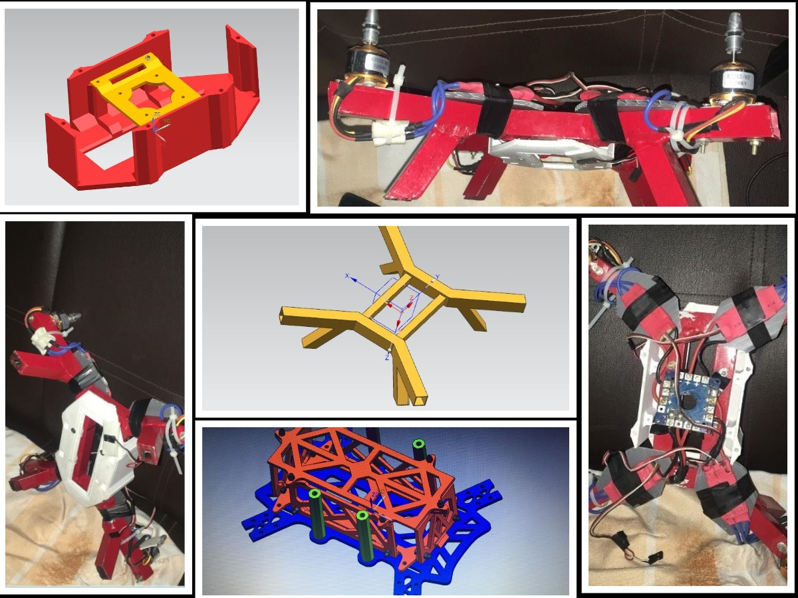
<iframe src="https://drive.google.com/file/d/16gVv8Nz-2nTw7Rf4l84OMdho4PCZcGtm/preview" width="440" height="280"></iframe>

Python API to automate belt drive design     
=============================================================================
[Back to Project List](#projectlist) &nbsp;&nbsp; _Nov 2018_

**Overview :** 
This Project involves, the creation of an application to automate the design process of a flat-belt drive system. 
**Manual Process Disadvantages:** 
The manual design calculation is a tiresome process, involving many substitutions in pre-derived formulae. In case of design failure during stress testing, the design process has to be repeated again from the beginning. This is not only a tiresome process but also an inefficient one. 
**The Automated Process** 
- Thus with the advancement of faster computing and better user interfaces an application can be programmed or created to automate the above explained process. 
- These programs can produce results with viable inputs in milli-seconds.  
- Design failure can be treated with absolute simplicity i.e. just by altering the input values and the rest of the process is executed once again automatically with a click.

[View repository on Github](https://github.com/vsranjitroshan/beltDriveDesign_python){:target="_blank"}  
_Python API Screen:_
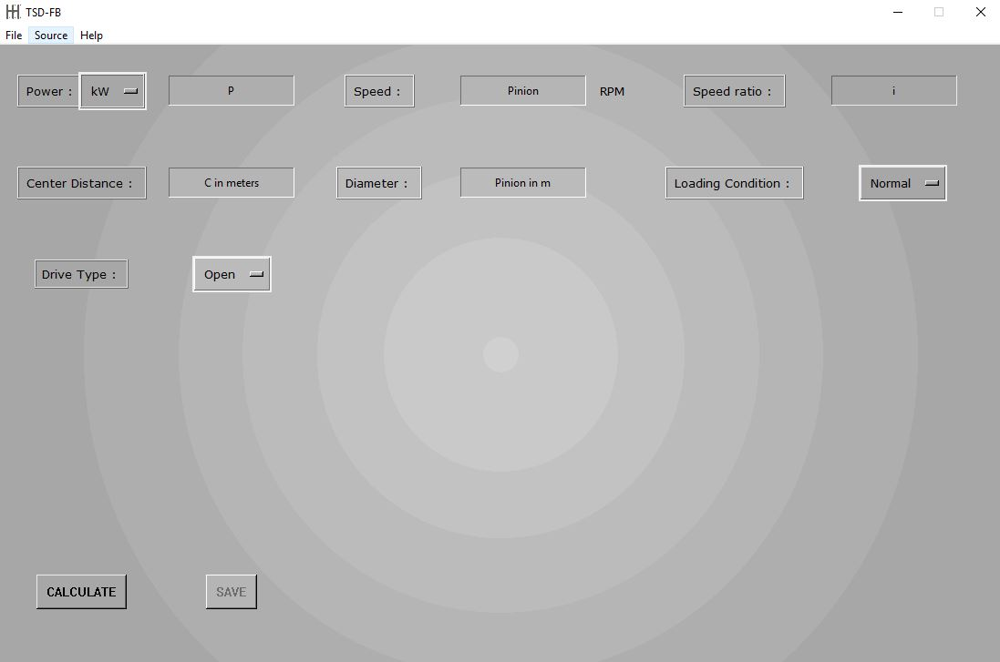
_Output in PDF Format:_
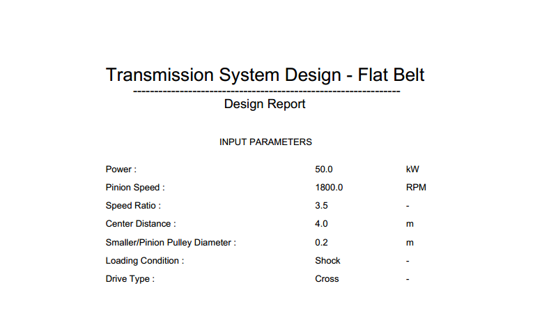
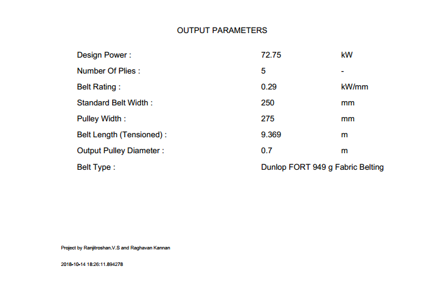

Data logging API for Drone test rig
=============================================================================
[Back to Project List](#projectlist) &nbsp;&nbsp; _Feb 2019_

**Overview** 
In order to understand and tune the drone features like battery life, PID values, throttle curve etc there is the need for data logging. This API provides the tool to record data and is based on Pyserial and Arduino library. 
**Features** 
- The program is portable to any place just using some arduino pins and a USB-COM Port. 
- The program saves the data in a time-stamped file with a meta-file which stores additional user data during the initial and final stages of recording. 
- The data is stored in plain text documents as comma seperated files(.csv), which can used in data analysis tools like pandas and excel. 

[View repository on Github](https://github.com/vsranjitroshan/dataLogger_UsbSerial_python){:target="_blank"}  
_API Interface:_
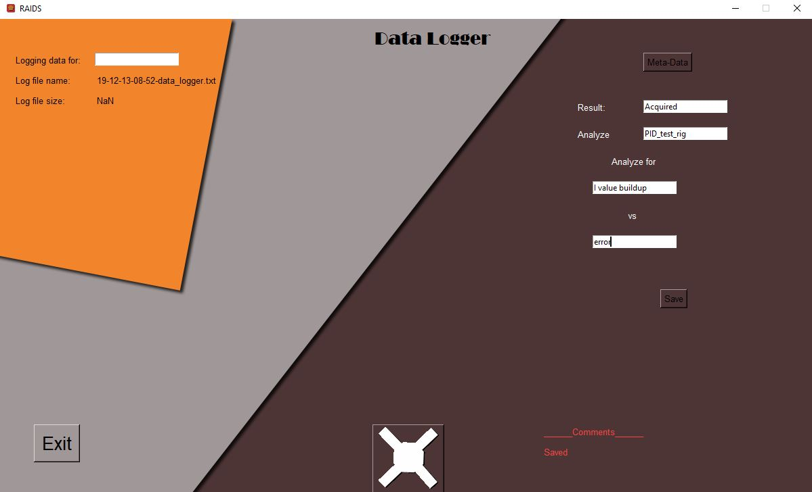
_Data and Meta files:_
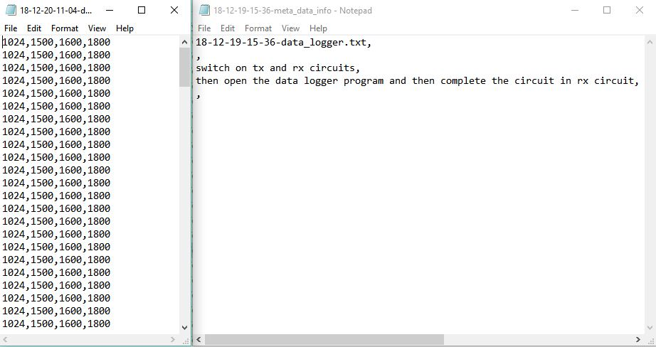
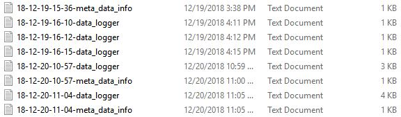

<!-- 

Damping characteristics visualisation using Excel 
=============================================================================
[Back to Project List](#projectlist) &nbsp;&nbsp; _May 2017_

**Features** 
Based on the spring and damper hard point data of a vehicle, the compression and rebound curves are plotted. The plot gives compression and rebound force for various velocities which are tuned by adjusting the damping coefficient for better ride characteristics. 

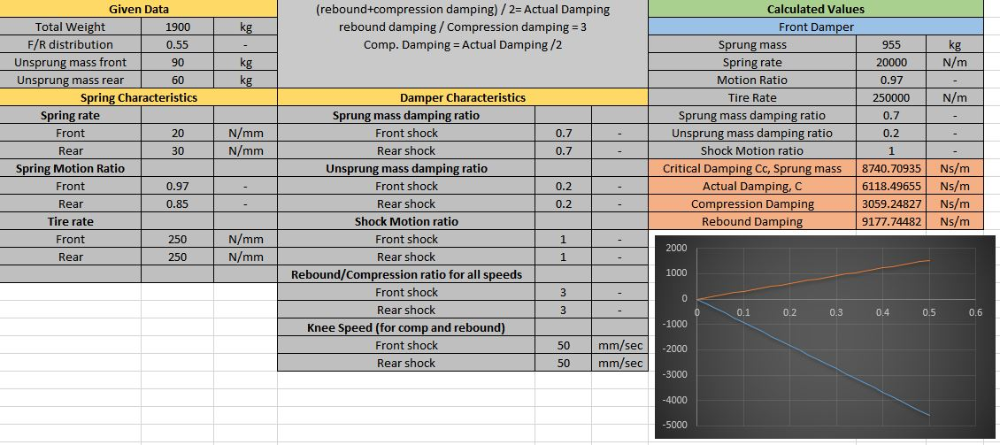 -->
<!-- 

Vehicle flat ride curve for different configurations - Gross and half load
=============================================================================
[Back to Project List](#projectlist) &nbsp;&nbsp; _July 2017_

**Overview:**
This plot is used to analyze the ride frequency oscillations. 

**Ride Frequency in Detail:** 
- The ride frequency is a fucntion of the front and rear spring attributes, sprung and unsprung mass. 
- The curve behaves differently for different loading conditions such as Curb-weight, which is only the weight of the car without passengers and the gross weight which includes passenger and cargo.
- The ride frequency must be between 1~2 hz and a lower or higher value will cause rider discomfort and nausea.

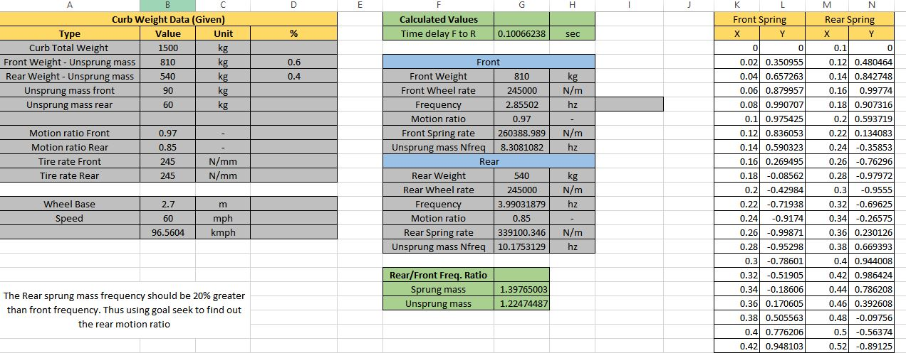
_Curb weight plot_
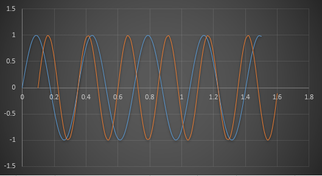 -->

Two motor test rig to understand PID Tuning
=============================================================================
[Back to Project List](#projectlist) &nbsp;&nbsp; _Aug 2017_

**Overview:** 
PID (Proportional, Integral and Derivative) controller is the most common control system used in Drones with exceptions such as PI and PD which are derivates of PID. Thus a test rig is fabricated to understand the PID tuning of a drone by trial and error method in real time. 
**Design process** 
- The two motor test rig is used to tune the system by trial and error method. 
- First the P Value is tuned until peak oscillation (high vibration) which means the system is over-compensating. 
- The P is reduced to half and then the I value is slowly increased in small fractions such as 0.01 since it accumulates at a rate of 250 times per second. 
- Then the D value is increased which retards any acceleration. very high D value is observed is the system does not allow to make any movements and at that point the D value is reduced. 
- This way the below test rig is tuned for optimum self-balancing. 

_PID Test Rig_
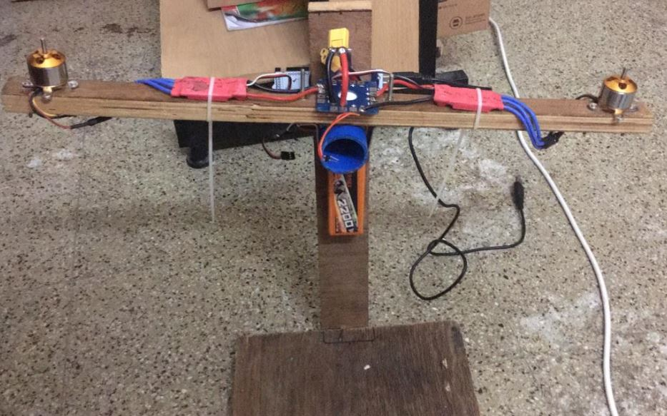

Micro quadcopter frame design and fabrication
=============================================================================
[Back to Project List](#projectlist) _Nov 2017_
 
**Overview:**  
A microquad is a frame which is in the category of 250g and below. This project is aimed at designing a 3D printable frame  
**Process:**  
The frame is modelled considering that the thrust is provided by 8mm coreless motor and 60mm propellers. A IRF540 voltage controlled current mosfet is used to vary the speed of the motors. 

[View Model](https://grabcad.com/library/micro-quadcopter-frame-1){:target="_blank"}

<iframe src="https://drive.google.com/file/d/1svaWj1un7O_2lFv6vY5_RwPR7c6ILm83/preview" width="440" height="280"></iframe>

Robotic Arm design and circuit fabrication
=============================================================================
[Back to Project List](#projectlist) &nbsp;&nbsp; _April 2018_

**Overview:** 
Robotic arm are of various types and this is an articualated type which mimic's a human arm.
**The Design Process:** 
- I went to a workshop on 3D printing and found a service provider near me.
- For the kinematics of machinery project, I modelled the robotic arm and 3D printed it.
- The circuit was designed using EasyEDA and JLCPCB provides a very low rate on circuit fabrication (2$ for 10 PCB's).
- I tried their service and got the board within a week time. I solered the components and tested the circuit.
- The design was not good and had a lot of assembly issues since I didn't account for various 3D printing parameters. I thought not to post this project, but convinced myself that my failures will surely help someone else to design a successful project. 

**Tips:**   * Account for 3D printing parameters like wall thickness and warping especially for ABS materials. Design curves considering the          extruder diameter to get better shape accuracy and think about the axis of printing for better strength. 
       * During any mechanical design, especially cases where movements are default, consider dynamic forces on the body.  
       * Test the actuators with loads prior to designing to get better focus on what is achievable in reality.

<iframe src="https://drive.google.com/file/d/129rR5ZFK4MuVYPfQjMhfjkrr8us1eEwG/preview" width="440" height="280"></iframe>
<iframe src="https://drive.google.com/file/d/1Fl5sxpJg_JtpvMeCFXc11l2F_TS7OqFk/preview" width="440" height="280"></iframe>
<iframe src="https://drive.google.com/file/d/1AzP2k_zsIMuxpWfUex_wcJrfOpzFXNBK/preview" width="340" height="180"></iframe>
<iframe src="https://drive.google.com/file/d/1GyhMwMNv7ejOTdoGNr2ph8AjSt81jR05/preview" width="440" height="280"></iframe>

<!-- 

 Optical low cost tachometer circuit design
=============================================================================
[Back to Project List](#projectlist) &nbsp;&nbsp; _April 2019_

**Overview:** 
Metrology is the study of measurements standards and techniques. This being a part of my curriculum, I took the project of designing a decent tachometer based on available tools. 
**The Design Process:** 
- After going through various aspects to measure RPM (Revolutions per minute) like measuring using encoder, hall effect etcetera optical obstruction seemed like the way to go. 
- The arduino has an interrupt function which is called whenver a change in voltage is observed in the analog pin with refrence to another analog pin. 
- The interrupt handler has a counter which gets incremented every time it is called and a refresh rate of 250 hz (i.e, interrupt being called 250 timed per second) can be achieved quite effortlessly. 
- A laser is pointed on two LDR's (Light dependent diodes) which are monitored for interrupts by the controller. 
- This is a non-contact type tachometer but the only requirement is that the rotating object must have a slim protrusion which can act as a obstruction to the laser source. 
- The circuit diagram shows the connections for the diodes and the wires to be connected to the arduino nano. 
- The LDR can vary its output based on ambient light changes too, hence a potentiometer is integrated to vary the refrence analog voltage. The system must be set and must be calibrated before actual measurement. 

<iframe src="https://drive.google.com/file/d/17cLcyLHuudeTYt8weOdfksoMZv76OEw5/preview" width="440" height="280"></iframe> -->

Bicopter controller circuit design
=============================================================================
[Back to Project List](#projectlist) &nbsp;&nbsp; _Nov 2019_

**The Bicopter:** 
The bicopter is a drone with four actuators and unlike a quadcopter the lifting thrust is provided by two and the other two actuators do 
the work of tilting the thruster axis to control roll and yaw motion. 
**The Problem** 
Since aluminium is the primiary material we work with, due to material availability, machining and cost effectiveness the circuits often tend to shortcircuit when testing and during crashes. In order to do quick testing one cannot keep insulating and removing the insulation all the time to change and tune PID values. 
**The Solution:** 
Hence I designed this circuit with an external relay circuit which once activated by a switch is powered by the controller itself. This can be used as a worst case kill switch but that's the most worst case.

<iframe src="https://drive.google.com/file/d/1cZzxsjWjvbPHn8EWmUKaTTPfMXSHzwox/preview" width="440" height="280"></iframe>

Quadcopter control system programming using Arduino
=============================================================================
[Back to Project List](#projectlist) _Dec 2019_

**Overview:**  
Implementation of a PID controller using an Arduino to control a quadcopter. 
**Process:**  
 - In order to establish a closed loop controller a sensor which can detect the system changes is required. 
 - The MPU6050 6 axis Gyro and accelerometer sensor provides the data to stabilize the system. 
 - The data is collected through the I2C bus and then using filters and sensor fusion the drone inclination angle is found out. 
 - This angle is compared to the Transmitter stick inputs and the residual error is compensated using the PID controller. 
( I will post a detailed note on every step as soon as I complete the project)

<iframe src="https://drive.google.com/file/d/1IXOERijieDnMChUZqTCqTlRZEKkVmyKC/preview" width="440" height="280"></iframe>
<iframe src="https://drive.google.com/file/d/1I7Ke4p8WtdWQZ2ZQXZSl6QCvFpKofY56/preview" width="440" height="280"></iframe>

<h1>EXTRAS</h1>

IMU Visualization using VPython
=============================================================================
[Back to Project List](#projectlist) _Dec 2019_

[Github](https://github.com/vsranjitroshan/IMU_visualization_using_Python){:target="_blank"}   
**Overview**  
Real time visualization of a IMU using VPython and Arduino
**Implementation**  
 - In order to make sense of the data from a sensor we need a visual aid. VPython provides the tool the create models and 
   make rotations.
 - The raw data is obtained from the sensor and is processed using complimentary filters to obtain angular rates and angles.
 - The data is sent via a serial bus and the sensor model is rotated according to the sensor readings in real time.
 (The visualization is under constuction and below is a sample of the tool)
 
 <iframe src="https://drive.google.com/file/d/1IQTik2kk5DzR6sD6E-Kmy1Qb9wJhbvWb/preview" width="440" height="280"></iframe>
